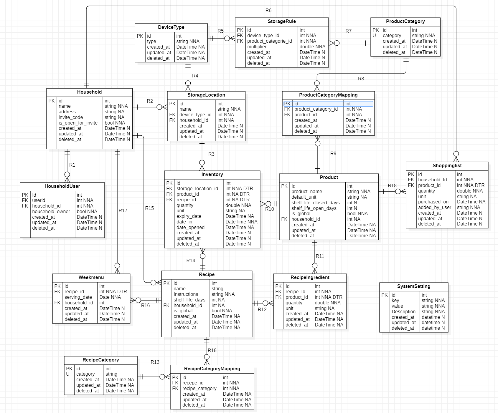

# 🍳 MyKitchen - Pantry Management System

MyKitchen is een comprehensive applicatie voor het beheren van voorraden, boodschappenlijsten en recepten binnen een huishouden. Het systeem is ontworpen om verspilling tegen te gaan en het kookproces te stroomlijnen door middel van een slimme koppeling tussen voorraad, opslagregels en recepten.

## 📖 App Overzicht & Functionaliteit

De applicatie fungeert als een digitale assistent voor de keuken. In plaats van enkel een lijst met producten, integreert MyKitchen intelligente suggesties voor houdbaarheidsdata en een publicatiesysteem voor gemeenschappelijke kennis.

### 🌟 Kernfunctionaliteiten
- **Voorraadbeheer:** Bijhouden van wat er in huis is, waar het ligt en wanneer het verloopt.
- **Slimme Houdbaarheid:** Het systeem suggereert vervaldata op basis van de opslaglocatie (zie *Business Logic*).
- **Recepten & Producten:** Een hybride systeem waarbij zowel globale (gevalideerde) als persoonlijke items bestaan.
- **Boodschappenlijsten:** Dynamische lijsten die helpen bij het aanvullen van de voorraad.
- **Huishoudens & Onboarding:** 
    - Gebruikers kunnen lid worden van één of meerdere huishoudens.
    - Huishoudens kunnen meerdere leden hebben.
    - Toegang tot een huishouden wordt geregeld via een unieke **invite code**, waardoor samenwerking tussen gezinsleden of huisgenoten mogelijk is.

### 🛠 Business Logic: Storage Rules
Een uniek aspect van dit ontwerp is de `StorageRule`. In de database wordt een `multiplier` gebruikt die gekoppeld is aan het type opslag (bijv. vriezer, ijskast, keukenkast). 
- Wanneer een gebruiker een product toevoegt aan een specifieke locatie, berekent de app een **gesuggereerde vervaldatum** door de basis-houdbaarheid van het product te vermenigvuldigen met de multiplier van de opslaglocatie. 
- *Voorbeeld:* Een product in de vriezer heeft een hogere multiplier dan in de koelkast, waardoor de gesuggereerde houdbaarheidsdatum verder in de toekomst ligt.

## 🚀 Tech Stack
...

- **Frontend:** Angular 20 (Standalone Components, NO modules)
- **Backend:** C# / .NET (Entity Framework Core)
- **Database:** PostgreSQL (via Docker)
- **Authentication:** Auth0 (JWT, Role-based access control)
- **Styling:** Tailwind CSS & FontAwesome

## 📋 Project Requirements & Implementation

Dit project is ontwikkeld volgens specifieke technische vereisten:

### 🛠 Backend & Database

- **Relational Database:** Gebruik van een relationeel model gebaseerd op het ERD.
- **EF Core:** De database wordt beheerd via EF Core. Mapping-tabellen (zoals `ProductCategoryMapping`) worden intern door EF Core afgehandeld als join-tabellen.
- **Data Integrity:** Er wordt gebruik gemaakt van **Soft Deletes**, waardoor gegevens niet fysiek uit de database worden verwijderd, maar gemarkeerd als 'verwijderd'. Dit voorkomt accidentele dataverlies en behoudt referentiële integriteit.
- **Security:** De API is beveiligd met JWT-tokens via Auth0.
- **CORS:** Correct geconfigureerd voor communicatie met de Angular frontend.
- **User Management:** In lijn met de vereisten bevat de database **geen** gebruikers-tabel; alle identiteitsbewaking vindt plaats via Auth0.

### 💻 Frontend (Angular)
- **Architecture:** Volledig opgebouwd met **Standalone Components**.
- **Routing & Navigation:** 
  - Dashboard/Startscherm voor alle gebruikers.
  - Rol-gebaseerde navigatie: De interface past zich aan op basis van de Auth0-rol (`Administrator` vs `Regular User`).
- **Forms:** Implementatie van zowel **Reactive Forms** als **Template-driven Forms**.
- **UX/UI:**
  - Geen page refreshes (Single Page Application).
  - Volledig responsive design via Tailwind CSS.
- **HTTP:** Gebruik van `HttpClient` voor asynchrone communicatie met de C# API.

## 🗄 Database Model (ERD)

De applicatie is gebouwd rondom de volgende kern-entiteiten:
- **Household:** De centrale eenheid waaraan producten en gebruikers zijn gekoppeld.
- **Product & ProductCategory:** Beheer van beschikbare producten en hun categorisering.
- **Inventory:** De actuele voorraad per huishouden, inclusief houdbaarheidsdata.
- **Shoppinglist:** Een dynamische lijst voor benodigde aankopen.
- **Recipe & RecipeIngredient:** Beheer van recepten en de benodigde ingrediënten.
- **StorageLocation & DeviceType:** Specifieke locaties (bijv. koelkast, vriezer) en apparatuur.

## ⚙️ Installatie & Setup

### 1. Database
Start de PostgreSQL database via Docker:
```bash
docker-compose up -d
```

### 2. Backend
1. Navigeer naar de `/backend` map.
2. Configureer de `appsettings.json` met je Auth0 domein en client-id.
3. Start de API via je IDE of `dotnet run`.

### 3. Frontend
1. Navigeer naar de `/frontend` map.
2. Installeer dependencies: `npm install`.
3. Configureer de Auth0 instellingen in de environment files.
4. Start de app: `npm start`.

## 👥 Rollen & Rechten

### 🔑 Administrator (Content Manager)
De Administrator fungeert als de beheerder van de globale content en kwaliteitsbewaker van de database:
- **Globale Lijsten:** Kan globale lijsten van producten en categorieën aanmaken en beheren.
- **Categoriebeheer:** Volledige CRUD-rechten op productcategorieën.
- **Curatie:** Heeft de macht om producten en recepten die door reguliere gebruikers zijn toegevoegd, te controleren en te **publiceren**, zodat ze beschikbaar komen voor alle gebruikers.
- **Systeembeheer:** Volledige toegang tot de administratieve CRUD-interfaces.

### 👤 Regular User
De reguliere gebruiker richt zich op het persoonlijke beheer van de keuken en het delen hiervan met huishoudgenoten:
- **Zichtbaarheid:** Kan alle globale (gepubliceerde) recepten en producten inzien, naast zijn eigen privé-collectie.
- **Persoonlijk Beheer (CRUD):** Kan eigen producten, recepten en voorraaditems toevoegen, bewerken en verwijderen. Producten en recepten staan in status 'concept' tot ze door de Admin worden gepubliceerd.
- **Huishoudelijk Beheer:** Kan nieuwe huishoudens aanmaken of zich aanmelden bij bestaande huishoudens via een invite code.
- **Voorraad & Lijsten:** Beheert de eigen voorraad en boodschappenlijsten binnen de gekoppelde huishoudens.

## Users
| gebruiker | wachtwoord | rol |
|:--- |:--- |:---|
|john.doe@example.com|p@ss1234| gebruiker|
|jane.doe@example.com|p@ss1234| gebruiker|
|admin@example.com| p@ss1234 |admin|

u kan ook zelf gebruikers aanmaken.